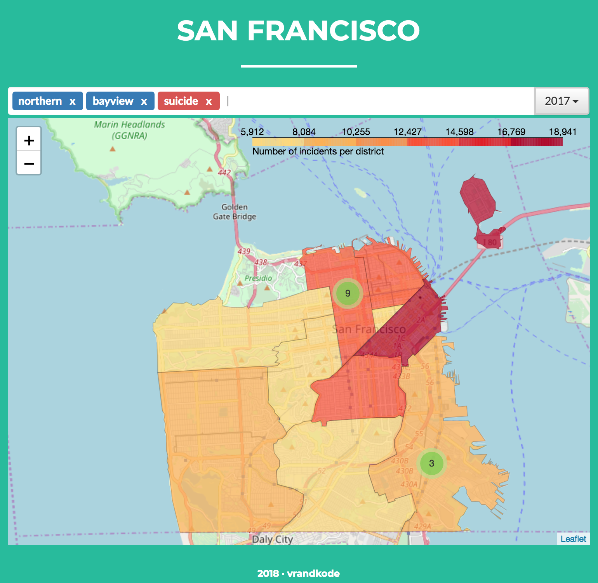

# San Francisco Crimes - Map representation

San Francisco "Crime data" map representation using #Flask and #Folium. #bootstrap3 #python #javascript #leaftlet #docker

* Flask
* Leaflet / Folium
* Bootstrap v3.0
* Docker (local)/ Kubernetes (Google Cloud)



## Desplegar cluster en local con Docker

### Requisitos

* Docker instalado y entorno configurado

```eval $(docker-machine env default)```

### Construir y desplegar nodo cassandra

Requiere construir un volumen persistence donde alojar los datos para
poder reciclar los datos exportados al ring de cassandra.

```sh
docker build -t sfcassandra/v1.0 .
```

* Crear el volumen y acceder desde un contenedor ubuntu para monitorizarlo

```sh
docker volume create sfcassandra-volume
docker run --name sfaccess \
            -v cassandra-volume:/opt:r \
            -ti ubuntu /bin/bash
```

* Despliegue en local. Añadimos el volumen y desplegamos la instancia

```
docker run -p 9042:9042 --name sfcassandra \
	-v cassandra-volume:/var/lib/cassandra:rw \
	--ulimit nofile=100000:100000 \
	--ulimit nproc=32768 \
	--memory-swappiness -1 \
	sfcassandra/v1.0
```
* ¿Cuál es la ip ?
```
docker inspect sfcassandra \
    --format '{{ .NetworkSettings.IPAddress }}'
```

## Importar los datos del dataset sobre el mismo nodo

En ```docker-entrypoint-initdb.d/init.cql``` se encuentra el esquema CQL con los comandos COPY de importación/exportación del dataset. El dataset se descarga una vez creada la imagen (Ver cassandra/Dockerfile).

```
docker exec -it sfcassandra \
    sh -c 'exec cqlsh -f /docker-entrypoint-initdb.d/init.cql'
```

## Construir y desplegar la aplicación (app)

Una vez sepamos la ip del nodo de cassandra lo inyectamos como variable de entorno en el despliegue de la aplicación (-e CASSANDRA_HOST='172.17.0.2)

* ¿Cuál es la ip del nodo de cassandra?
```
docker inspect sfcassandra \
    --format '{{ .NetworkSettings.IPAddress }}'
```

* Construimos el contenedor con la aplicación Flask/Nginx
```
cd app
docker build -t sfapp/v1.0 .
```

* Despliegue del nodo en local
El nodo se expone en el puerto 80, dado que el contenedor contiene
```
docker run -p 80:80 --name sfapp \
	-e CASSANDRA_HOST='172.17.0.2' \
        --ulimit nofile=100000:100000 \
        --ulimit nproc=32768 \
        --memory-swappiness -1 \
        sfapp/v1.0
```

## ¿Cómo comprobar el acceso al recurso?

```
docker-machine ls
```

