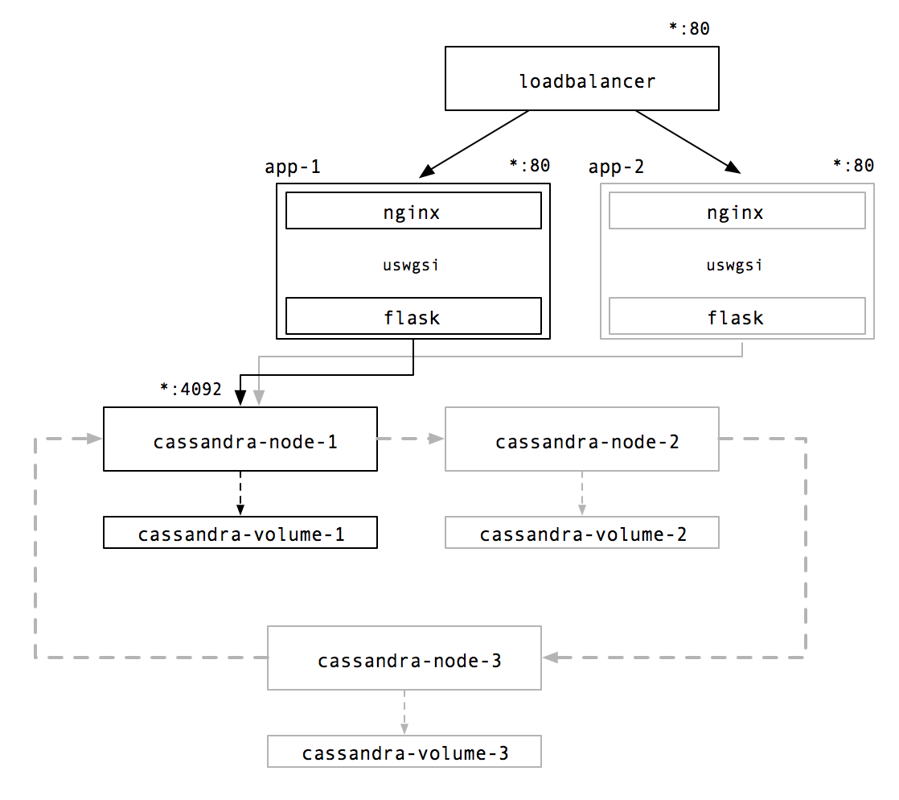

# San Francisco Crimes

_Representación de crímenes en San Francisco mediante una aplicación web con **#Flask** and **#Folium**. Entre otras tecnologias de desarrollo frontend/backend usadas se encuentran **#bootstrap3** **#python** **#javascript** **#leaftlet**. Para el despliegue en local o en la nube (**Google Cloud**) se añaden indicaciones y procedimientos mediante **#docker** y/o **#kubernetes**._

Es una representación minimalista de una zona amplia geográfica de la ciudad de **San Francisco**. Los **distritos** son remarcados en el mapa con un índice de peligrosidad/riesgo (densidad de incidencias por zona). Desde la barra de navegación se puede actualizar la información de los marcadores de incidencias del mapa. Mediante la elección de etiquetas ("tags") de los tipos de **distrito** o tipo de **incidencia** la información será de una forma u otra acotada en acorde al criterio construido.

### Tecnologías usadas

* Flask (python web)
* Leaflet (maps with avg)/ Folium (python framework)
* Bootstrap v3.0 (visual web components)
* Docker (local)/ Kubernetes (Google Cloud)


* [Visualización de datos sobre mapas mediante Leaflet/Folium](#)
* [Estructuras de datos en Cassandra](#)

* [Arquitectura](#)

* [Despliegue en **local** mediante **Docker**](#)
    * [Requisitos](#requisitos-para-el-entorno-docker)
    * [Construir y desplegar un nodo Cassandra ](#)
    * [Construir y desplegar la aplicación web](#)

* [Despliegue en **Google Cloud** mediante **Kubernetes**](#)
    * [Requisitos](#requisitos-para-el-entorno-kubernetes)
    * [Construir y desplegar nodos Cassandra ](#)
    * [Construir y desplegar la aplicación web ](#)

[·volver·](#San.Francisco-Crimes)

## Visualización de datos sobre mapas mediante Leaflet/Folium

*Folium* es un framework para Python que facilita y generar mapas interactivos mediante *Leaflet* desde el *backend*. Los mapas son renderizados sobre html, por lo que no es necesario construir ni representar información desde la parte *frontend* de la aplicación.

Se han definido los siguientes endpoints de acceso:

* ```[/]``` Acceso principal, realiza:
  * Peticiones para obtener información de todos **los distritos y tipos de delitos disponibles**
  * **Genera la información y renderiza el mapa** con los marcadores de las incidencias sobre *generated_map.html*, mostrado como vista.
* ```[/generated_map/<attribute>]``` Al añadir una etiqueta (distrito/tipo de delito) queremos obtener la información filtrada bajo nuestro criterio. La expresión es construida como json: si añadimos las etiquetas _northern_, _bayview_ y _assault_


  1. Se genera un objeto traducido a _json_ ```{ "district": ["northern", "bayview"] , "category": ["assault"] }```
  2. Se codifica para obtener un token único para cada tipo de consulta con base64: ```eyAiZGlzdHJpY3QiOiBbIm5vcnRoZXJuIiwgImJheXZpZXciXSAsICJjYXRlZ29yeSI6IFsiYXNzYXVsdCJdIH0=```
  3. Este token se utiliza para realizar petición de generación de mapa para ese criterio específico **(OJO: MEDIANTE LA UTILIZACIÓN DE UN TOKEN IDENTIFICATIVO SE PODRÍA PERMITIR AÑADIR CACHING SOBRE EL SERVICIO AGILIZANDO LA CONSULTAS QUE SE REPITIERAN)** (Ver Flask-Caching). Si realizamos la llamada a ```/generated_map/eyAiZGlzdHJpY3QiOiBbIm5vcnRoZXJuIiwgImJheXZpZXciXSAsICJjYXRlZ29yeSI6IFsiYXNzYXVsdCJdIH0=``` se genera un único mapa bajo el mismo identificador, único para cada criterio.


* ```[/generated_map]``` Sin filtros. Usado en el acceso principal.

[·volver·](#San.Francisco-Crimes)

## Arquitectura

Una visión de la arquitectura de nodos de Cassandra y un cluster de la aplicación web balanceado en carga en el proveedor Google Cloud, utilizando Kubernetes.




[·volver·](#San.Francisco-Crimes)
## Desplegar cluster en local con Docker


[·volver·](#San.Francisco-Crimes)
### Requisitos para el entorno Docker

* Docker instalado [Windows](https://docs.docker.com/docker-for-windows/install/)/[Mac](https://docs.docker.com/docker-for-mac/install/) y entorno configurado:  ```eval $(docker-machine env default)```

### Construir y desplegar un nodo Cassandra

Requiere construir un volumen persistente donde alojar los datos y poder
exportarlos a otro datacenter o ring de Cassandra.

```sh
docker build -t sfcassandra/v1.0 .
```

* Crear el volumen y acceder desde un contenedor *ubuntu* para monitorizarlo

```sh
docker volume create sfcassandra-volume
docker run --name sfaccess \
            -v cassandra-volume:/opt:rw \
            -ti ubuntu /bin/bash
```

Una vez en el interior podemos revisar en segundo plano el crecimiento del sistema de ficheros, por ejemplo cuando importamos los datos mediante el comando COPY de casssandra.

```
$ watch -n 2 "du -sh /var/lib/cassandra/**" 
```

* Despliegue en local. Añadimos el volumen y desplegamos la instancia

```
docker run -p 9042:9042 --name sfcassandra \
	-v cassandra-volume:/var/lib/cassandra:rw \
	--ulimit nofile=100000:100000 \
	--ulimit nproc=32768 \
	--memory-swappiness -1 \
	-d sfcassandra/v1.0
```

Nota: En caso de errores de conflictos por el nombre de la instancia, eliminamos las posibles imágenes de instancias pendientes con el mismo nombre.

```
docker ps -a|grep sfcassandra|awk '{print $1}'|xargs docker stop
docker ps -a|grep sfcassandra|awk '{print $1}'|xargs docker rm
```

```
docker ps -a|grep sfcassandra|awk '{print $1}'|docker logs -f 
```

* ¿Cuál es la ip ?
```
docker inspect sfcassandra \
    --format '{{ .NetworkSettings.IPAddress }}'
```

### Importar los datos del dataset sobre el mismo nodo

En [docker-entrypoint-initdb.d/init.cql](cassandra/docker-entrypoint-initdb.d/init.cql) se encuentran los esquemas de creación en sintaxis CQL, además se incluyen los comandos COPY de importación/exportación sobre el dataset en raw que ya se encuentra alojado en los contenedores Docker en la ruta del sistema /datasets/incidents.all.csv; el dataset se descarga una vez creada la imagen (Ver [cassandra/Dockerfile](cassandra/Dockerfile) ).

Se lanza el script de inicialización sobre uno de los nodos:

```
docker exec -it sfcassandra \
    sh -c 'exec cqlsh -f /docker-entrypoint-initdb.d/init.cql'
```

**Nota:** Si el contenedor elegido no es el personalizado, antes de ejecutar el script debemos descargar el dataset y alojarlo en el sistema:

```
$ docker exec -ti sfcassandra \
    sh -c 'exec apt-get update \
        && apt-get install -y wget \
            && wget -O mega.py https://gist.githubusercontent.com/vrandkode/7a31d261f26c1f6db4ddbb8ea7fbb0cc/raw/2460dee8e50cd148a59277b829eed22f336b1e78/mega.py \
            && mkdir /datasets && python mega.py 'https://mega.nz/#!GqRlAaRC!r5zOJxSZwXe40ov_7zhqiLqThOij804K9g73y_Q_DaA'
            && mv mega_GqRlAaRC_incidents.all.csv /datasets/incidents.all.csv'
```

### Construir y desplegar la aplicación web

Una vez tengamos la ip de uno de los nodos de Cassandra lo inyectamos a la configuración de la aplicación desde una variable de entorno durante el despliegue de la aplicación (-e CASSANDRA_HOST='172.17.0.2)

* ¿Cuál es la ip del nodo de cassandra?
```
docker inspect sfcassandra \
    --format '{{ .NetworkSettings.IPAddress }}'
```

* Construimos el contenedor con la aplicación Flask/Nginx
```
cd app
docker build -t sfapp/v1.0 .
```

* Despliegue del nodo en local

El nodo se expone en el puerto 80, dado que el contenedor contiene la aplicación en Flask encapsulado por el proxy Nginx, y conectados entre sí mediante UWsgi (Recordamos IP del nodo de Cassandra: ```export CASSANDRA_IP="172.17.0.2"```)

```
export CASSANDRA_IP=`docker inspect sfcassandra --format '{{ .NetworkSettings.IPAddress }}'`
```

```
docker run -p 80:80 --name sfapp \
    -e CASSANDRA_HOST=$CASSANDRA_IP \
        --ulimit nofile=100000:100000 \
        --ulimit nproc=32768 \
        --memory-swappiness -1 \
        sfapp/v1.0
```

## ¿Cómo comprobar el acceso al recurso?
Necesitamos conocer la ip del Host de Docker (Windows/Mac):

```
$ docker-machine ls
NAME       ACTIVE   DRIVER       STATE     URL                         SWARM   DOCKER        ERRORS
default    -        virtualbox   Running   tcp://192.168.99.100:2376           v18.05.0-ce
```

Accedemos a **http://192.168.99.100**.

[·volver·](#San.Francisco-Crimes)


## Procedimientos manuales

### Restructurar red y especificación en el lanzamiento de nodos

```
$ docker network create --subnet=172.30.0.0/16 sfnetwork
$ docker run -p 9042:9042 --rm              \
    --name sfcassandra                      \
    --net sfnetwork --ip 172.30.0.3 -d      \
    sfcassandra
```

## Despliegue en **Google Cloud** mediante **Kubernetes**

### Referencias
* Cassandra docker project. https://github.com/bitnami/bitnami-docker-cassandra
* IBM Steps. https://github.com/IBM/Scalable-Cassandra-deployment-on-Kubernetes
* Stateful references from kubernetes. https://kubernetes.io/docs/tutorials/stateful-application/cassandra/
* Deploy a HA Cassandra AWS. https://medium.com/merapar/deploy-a-high-available-cassandra-cluster-in-aws-using-kubernetes-bd8ba07bfcdd


### Requisitos para el entorno Kubernetes

* Preparación del contexto Docker 

```
eval $(docker-machine env default)
```

* Instalación de Kubernetes cmd *kubectl* 
```
gcloud components install kubectl
```
* Preparación del contexto Kubernetes (bajo un proyecto)

```
kb()  { kubectl $@ ;}
export PROJECT_ID="$(gcloud config get-value project -q)"
```

### Construir y desplegar nodos Cassandra

* Creando el servicio para los nodos de Cassandra ([stateful sets](https://kubernetes.io/docs/concepts/workloads/controllers/statefulset/))

References: https://kubernetes.io/docs/tutorials/stateful-application/cassandra/

**Stateful set** es un servicio definido para un conjunto de nodos, idóneo para cuando cada nodo requiera ser único, con volumen persistente, y requiera estar fijado a un orden arbitrario durante el escalado o despliegue. La configuración del **servicio** la podemos encontrar en [kubernetes/cassandra-service.yaml](kubernetes/cassandra-service.yaml).

```
$ kb create -f cassandra-service.yaml
service "cassandra" created

$ kb get svc cassandra
NAME        TYPE        CLUSTER-IP   EXTERNAL-IP   PORT(S)    AGE
cassandra   ClusterIP   None         <none>        9042/TCP   14s
```

* Creamos los volúmenes persistentes

```
$ kb create -f cassandra-volumes.yaml
persistentvolume "cassandra-volume1" created
persistentvolume "cassandra-volume2" created

$ kubectl get pv
NAME                CAPACITY   ACCESS MODES   RECLAIM POLICY   STATUS      CLAIM     STORAGECLASS   REASON    AGE
cassandra-volume1   10Gi       RWO            Recycle          Available                                      7s
cassandra-volume2   10Gi       RWO            Recycle          Available                                      7s
```

* Añadimos la especificación de los nodos del Statefulset creado
La configuración del **statefulset** lo podemos encontrar en [kubernetes/cassandra-statefulset.yaml](kubernetes/cassandra-statefulset.yaml). 
Define la siguiente configuración para cada nodo de Cassandra:

    * Puertos: 9042, (internos) 7199 y 7000-7001
    * Parámetros de memoria: 256M (heap), rearrange 100M
    * Nombre del Cluster/DataCenter: SFCassandraCluster/SFDataCenter1
    
```
$ kb create -f cassandra-statefulset.yaml
statefulset "cassandra" created
$ kubectl get statefulsets
NAME        DESIRED   CURRENT   AGE
cassandra   1         1         12s
```

```
$kb get pods -o wide
NAME                           READY     STATUS    RESTARTS   AGE       IP           NODE
cassandra-0                    1/1       Running   0          1m        10.32.0.15   gke-sfcassandracluster-default-pool-670a8326-ltvm
```
Para comprobar si el nodo de Cassandra se encuentra **activo**, utilizamos la herramienta nodetool.

```
$ kb exec -ti cassandra-0 -- nodetool status
Datacenter: SFDataCenter1
=========================
Status=Up/Down
|/ State=Normal/Leaving/Joining/Moving
--  Address     Load       Tokens       Owns (effective)  Host ID                               Rack
UN  10.32.0.16  94 KiB     256          100.0%            868db7e3-f332-4013-8d37-c2f6d0c07df6  SFRack1
```

* Si queremos escalar añadiendo un nuevo nodo

```
$ kb scale --replicas=2 statefulset/cassandra
statefulset "cassandra" scaled

$ kb get statefulsets
NAME        DESIRED   CURRENT   AGE
cassandra   2         2         4m

$ kb get pods -o wide
NAME                           READY     STATUS    RESTARTS   AGE       IP           NODE
cassandra-0                    1/1       Running   0          4m        10.32.0.15   gke-sfcassandracluster-default-pool-670a8326-ltvm
cassandra-1                    1/1       Running   0          44s       10.32.0.16   gke-sfcassandracluster-default-pool-670a8326-ltvm
```

```
$ kb exec -ti cassandra-0 -- nodetool status
Datacenter: SFDataCenter1
=========================
Status=Up/Down
|/ State=Normal/Leaving/Joining/Moving
--  Address     Load       Tokens       Owns (effective)  Host ID                               Rack
UN  10.32.0.16  94 KiB     256          100.0%            868db7e3-f332-4013-8d37-c2f6d0c07df6  SFRack1
UN  10.32.0.15  108.62 KiB  256          100.0%            9295309b-8004-4ed5-a26b-4d1cb6de82c6  SFRack1
```

```
$ kb exec -ti cassandra-0 -- cqlsh
Connected to SFCassandraCluster at 127.0.0.1:9042.
[cqlsh 5.0.1 | Cassandra 3.11.3 | CQL spec 3.4.4 | Native protocol v4]
Use HELP for help.
cqlsh>
```

* Decomisionar un nodo del ring
Elegimos el nodo a decomisionar. El proceso conlleva la redistribución de la información sobre el resto, por lo cual es un un procedimiento delicado y no debería ser ininterrumpido.

```
$ kb exec -it cassandra-0 -- sh -c 'nodetool status'
Datacenter: SFDataCenter1
=========================
Status=Up/Down
|/ State=Normal/Leaving/Joining/Moving
--  Address     Load       Tokens       Owns (effective)  Host ID                               Rack
UL  10.32.0.16  312.57 MiB  256          52.8%             868db7e3-f332-4013-8d37-c2f6d0c07df6  SFRack1
UN  10.32.0.15  489.46 MiB  256          47.2%             9295309b-8004-4ed5-a26b-4d1cb6de82c6  SFRack1

$ kb exec -it cassandra-1 -- sh -c 'nodetool decommission'

$ kb exec -it cassandra-0 -- sh -c 'nodetool status'
Datacenter: SFDataCenter1
=========================
Status=Up/Down
|/ State=Normal/Leaving/Joining/Moving
--  Address     Load       Tokens       Owns (effective)  Host ID                               Rack
UN  10.32.0.15  584.7 MiB  256          100.0%            9295309b-8004-4ed5-a26b-4d1cb6de82c6  SFRack1

```

### Importación del dataset

* Descargar el dataset

Debemos descargar el dataset y alojarlo en el sistema, antes de ejecutar el script de inicialización CQL. 

```
$ kb exec -ti cassandra-0 --       \
        sh -c 'apt-get update      \
        && apt-get install -y wget \
        && wget -O mega.py https://gist.githubusercontent.com/vrandkode/7a31d261f26c1f6db4ddbb8ea7fbb0cc/raw/2460dee8e50cd148a59277b829eed22f336b1e78/mega.py \
        && mkdir /datasets && python mega.py 'https://mega.nz/#!GqRlAaRC!r5zOJxSZwXe40ov_7zhqiLqThOij804K9g73y_Q_DaA'
        && mv mega_GqRlAaRC_incidents.all.csv /datasets/incidents.all.csv
```

* Importación y creación de la estructura de datos

Lo realizamos sobre un solo nodo, si existe más de uno se encargará de compartir la información para su distribución homogénea o arbitraria.

i.e.
```
$ echo "describe keyspaces;exit;" |kb exec -ti cassandra-0 -- cqlsh
Unable to use a TTY - input is not a terminal or the right kind of file
system_schema  system_auth  system  system_distributed  system_traces  sf
```

```
echo "`cat cassandra/docker-entrypoint-initdb.d/init.cql` exit;" |kb exec -ti cassandra-0 -- cqlsh
```

## Procedimientos manuales sobre el contexto Kubernetes

* Construir y publicar nuevas imágenes de cassandra

Podemos actualizar las imágenes de las instancias usadas en los nodos (Pods) dentro de Google Cloud. Es una buena práctica usar distintas versiones y de manera incremental.

```
$ docker build -t gcr.io/$PROJECT_ID/sfcassandra:v1.0 .
$ gcloud docker -- push gcr.io/$PROJECT_ID/sfcassandra:v1.0
```

* Si queremos definir un perfil de cluster de nodos de ciertas características

```
$ gcloud container clusters create sfcassandracluster \
    --machine-type=n1-highmem-2 \
    --num-nodes=1
```

* Lanzar un nuevo nodo (Pod) de forma independiente

```
kubectl run sfcassandra --image=gcr.io/$PROJECT_ID/sfcassandra:v1 --port 9042
```

* Controlando los nodos

```
kubectl get pods
id=`kubectl get pods|grep cassandra|awk '{print $1}'`
kubectl exec -it $id -- bin/bash
kubectl exec -it $id -- sh -c 'nodetool status'
kubectl exec -it $id  -- sh -c 'exec cqlsh 10.32.0.12'
```

### Construir y desplegar la aplicación web

* Construimos y publicamos la imagen de la instancia con la aplicación
```
docker build -t gcr.io/$PROJECT_ID/sfapp:v2.5 .
gcloud docker -- push gcr.io/$PROJECT_ID/sfapp:v2.5
```

* Reescalado y despliegue
```
kb delete deployment sfapp
kb run sfapp --image=gcr.io/$PROJECT_ID/sfapp:2.5 \        
    --env="CASSANDRA_HOST=$CASSANDRA_IP"
```

* Creación del despliegue para el nodo web

Importante: Editar en caso de que requiera realizar cambios en la imagen de la instancia, para ello editar o recrear el template kubernetes/application-deployment.yaml

i.e
name: CASSANDRA_HOST: 10.32.0.16
image: gcr.io/sfdatascience-216716/sfapp:v2.16

En un principio se creó una configuración básica basada en:

```yaml
apiVersion: v1
kind: Service
metadata:
  name: application-service
spec:
  selector:
    app: sfapp
  type: ClusterIP
  ports:
  - name: http
    port: 80
    targetPort: 80
    protocol: TCP
```

**Nota:** Obtener configuración en cualquier momento ```kb get deployments sfapp --export=true -o yaml > current-deployment.yaml```

```
$ kb create -f kubernetes/application-deployment.yaml
$ kb expose deployment sfapp --type=LoadBalancer --name=sfapp-lb
$ kb get service sfapp-lb -o=yaml > kubernetes/application-balancer.yaml
```

[·volver·](#San.Francisco-Crimes)


